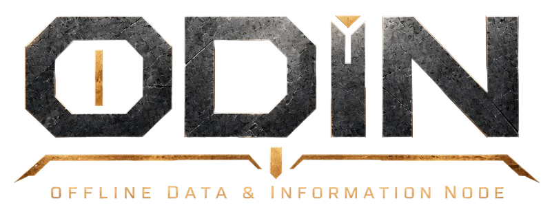
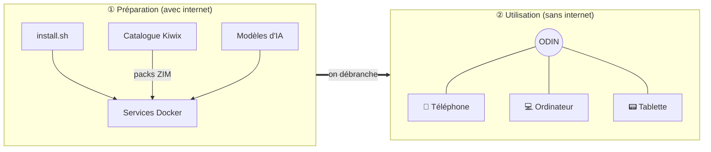
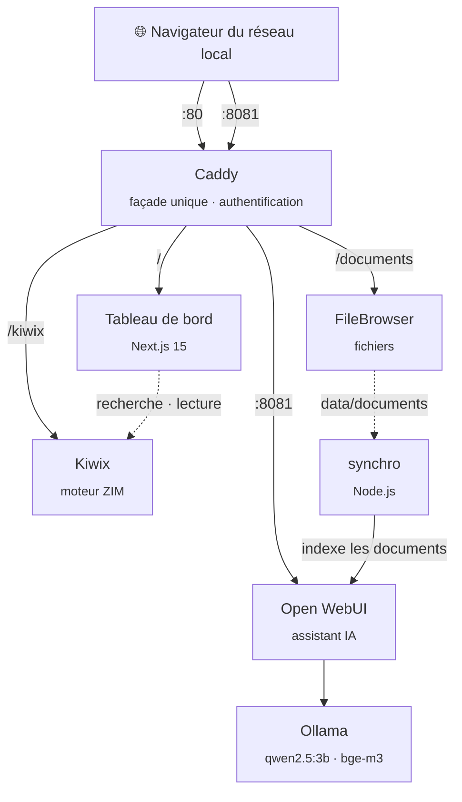

<div align="center">



### Le savoir du monde, même quand internet s'arrête.

Un serveur de connaissances **100 % hors ligne**, installable en une commande sur Ubuntu ou Debian.<br>
Wikipédia, des milliers de livres, vos documents et un assistant IA, pour tous les appareils du réseau local.

[](#licence)
[](#installation)
[](#architecture)
[](#hors-ligne-par-conception)

[Pourquoi ODIN](#pourquoi-odin) · [Fonctionnalités](#ce-quodin-vous-offre) · [Architecture](#architecture) · [Installation](#installation)

</div>

---

## Pourquoi ODIN

Internet semble acquis, et pourtant il manque souvent là où on en a le plus besoin : dans un
refuge de montagne, sur un bateau, dans une école isolée, pendant une panne ou une crise, ou
simplement quand on ne veut pas que ses questions quittent la maison.

**ODIN est une réserve de savoir que l'on prépare une fois et qui sert ensuite pour de bon.**
On l'installe sur une petite machine pendant qu'on a une connexion, on y charge les contenus
voulus (encyclopédie, médecine, livres, manuels, modèles d'IA), puis on le débranche d'internet.
Chaque téléphone, tablette ou ordinateur du réseau local y accède ensuite avec un simple
navigateur, **sans application, sans compte en ligne et sans aucune connexion extérieure**.

- 🧭 **Autonome** : une fois préparé, ODIN démarre, redémarre et répond sans internet.
- 🔒 **Privé** : rien ne sort du serveur, ni télémétrie, ni requête vers un service tiers.
- 🇫🇷 **Pensé en français** : interface, catalogue et modèles choisis pour un public francophone.
- 🪶 **Simple** : un seul fichier Docker Compose écrit à la main, sans orchestrateur ni magie.

> ODIN s'inspire de Project NOMAD. Il a été reconstruit de zéro, en plus simple.

## Ce qu'ODIN vous offre

| | Service | Ce qu'il fait |
|---|---|---|
| 📚 | **Bibliothèque** | Wikipédia, Wiktionnaire, Wikisource, Gutenberg, Vikidia… au format ZIM, avec recherche plein texte et un lecteur d'articles intégré. |
| 📁 | **Documents** | Un espace de fichiers partagé, accessible depuis n'importe quel navigateur du réseau. |
| 🤖 | **Assistant IA** | Un modèle de langage qui tourne sur la machine (qwen2.5:3b). Il répond à vos questions et consulte vos documents, qui sont indexés automatiquement. |
| 🖥️ | **Tableau de bord** | L'état des services, une recherche dans toute la bibliothèque, le stockage, et l'ajout de contenus en un clic tant qu'une connexion est disponible. |

L'accès est protégé par **un mot de passe unique**, choisi lors de la première visite.

### Contenus disponibles

Ils s'installent depuis le tableau de bord (**Configuration → Bibliothèque**) :

Wikipédia (sélection illustrée, complète, ou complète avec images) · Médecine · Mathématiques ·
Physique · Chimie · Histoire · Géographie · Informatique · Changement climatique · Vikidia (8-13 ans) ·
Wiktionnaire · Wikisource · Projet Gutenberg · Wikilivres · Wikiversité · Wikivoyage

La liste se modifie dans [`catalogue/packs.txt`](catalogue/packs.txt). Les fichiers proviennent du
[catalogue Kiwix](https://library.kiwix.org).

## Comment ça marche



Internet ne sert qu'à **préparer** ODIN : l'installer, le mettre à jour, ajouter des contenus.
Il n'est jamais nécessaire pour **l'utiliser**.

## Architecture

Tout passe par **Caddy**, la seule porte d'entrée. Caddy vérifie la session auprès du tableau de bord
(`forward_auth`), puis transmet chaque requête au bon service.



| Service | Image (version figée) | Rôle |
|---|---|---|
| `caddy` | `caddy:2.11.4-alpine` | Porte d'entrée, routage, authentification déléguée au tableau de bord. |
| `dashboard` | `ghcr.io/gorgo126/odin-dashboard` | Next.js 15 (app router, sortie standalone), sans autre dépendance que React. Accueil, recherche, lecteur d'articles, ajout de packs. |
| `kiwix` | `ghcr.io/kiwix/kiwix-serve:3.8.2` | Sert les archives ZIM de `data/zim`. Détecte les nouveaux contenus sans redémarrage. |
| `filebrowser` | `gtstef/filebrowser:1.5.6-stable` | FileBrowser Quantum, sur `data/documents`. |
| `ollama` | `ollama/ollama:0.34.2` | Exécute les modèles : qwen2.5:3b pour discuter, bge-m3 pour l'indexation. |
| `ia` | `ghcr.io/open-webui/open-webui` | Open WebUI en mode hors ligne, sans comptes (l'accès est déjà protégé par ODIN). |
| `synchro` | `node:20.20.2-alpine3.23` | Reporte chaque fichier de `data/documents` dans la collection « Mes documents » d'Open WebUI. |

Toutes les images sont **figées sur une version précise**. Une montée de version se fait
volontairement, après test.

### Arborescence

```
/opt/odin
├── compose.yml          # l'unique fichier de déploiement
├── Caddyfile            # routage et authentification
├── .env                 # ports et dossier des données (modèle : .env.exemple)
├── catalogue/packs.txt  # contenus proposés dans le tableau de bord
├── config/              # configuration de FileBrowser
├── dashboard/           # code du tableau de bord (Next.js)
├── synchro/             # synchronisation documents → IA
├── scripts/             # ajout de contenus en ligne de commande, outils de test
└── data/                # vos données, jamais versionnées
    ├── zim/             #   archives ZIM + library.xml
    ├── documents/       #   fichiers partagés
    ├── ollama/          #   modèles d'IA
    ├── openwebui/       #   conversations et index
    └── config/          #   mot de passe (haché avec scrypt)
```

### Hors ligne par conception

- **Aucune ressource externe** : pas de CDN, pas de police téléchargée, pas d'analytique.
- **Open WebUI** tourne avec `OFFLINE_MODE=true`, sans télémétrie, et l'exécution de code est désactivée.
- **Chaque appel réseau d'ODIN a un délai.** Hors ligne, le catalogue répond « injoignable » en
  2 secondes, et un téléchargement interrompu s'arrête après 30 secondes sans données. On peut
  aussi l'annuler, ou le reprendre plus tard là où il s'était arrêté.
- **Testé réellement déconnecté** : [`scripts/hors-ligne.sh`](scripts/hors-ligne.sh) coupe internet
  sur une machine de test en gardant le réseau local, et consigne chaque tentative de sortie.

## Installation

### Prérequis

| | Minimum conseillé |
|---|---|
| Système | Ubuntu 24.04 LTS ou Debian 12, architecture x86_64 |
| Processeur | 4 cœurs |
| Mémoire | 8 Go (l'assistant IA en utilise la majeure partie) |
| Disque | 40 Go, plus la taille des contenus (de 80 Mo à plusieurs dizaines de Go par pack) |
| Réseau | Une connexion internet **pendant l'installation seulement** |

### En une commande

```bash
curl -fsSL https://raw.githubusercontent.com/Gorgo126/ODIN/main/install.sh | sudo bash
```

Le script installe Docker si besoin, récupère ODIN dans `/opt/odin`, démarre les services et
télécharge les modèles d'IA (environ 3 Go). À la fin, il affiche les adresses où joindre ODIN.

### Première visite

1. Depuis n'importe quel appareil du réseau, ouvrez **http://odin.local**, ou l'adresse IP affichée à la fin de l'installation.
2. Choisissez le mot de passe qui protégera ODIN.
3. Dans **Configuration → Bibliothèque**, installez les contenus voulus tant que la connexion est disponible.
4. L'assistant IA est sur le port **8081** (par exemple http://odin.local:8081). Pour interroger vos
   documents, tapez `#` dans la conversation et choisissez « Mes documents ».

C'est prêt : vous pouvez débrancher internet.

### Options d'installation

Des variables, placées **après `sudo`**, ajustent l'installation :

```bash
curl -fsSL https://raw.githubusercontent.com/Gorgo126/ODIN/main/install.sh \
  | sudo NOM_HOTE=bibliotheque MODELE_CHAT=qwen2.5:7b bash
```

| Variable | Défaut | Effet |
|---|---|---|
| `NOM_HOTE` | `odin` | Nom de la machine sur le réseau (`http://<nom>.local`). |
| `MODELE_CHAT` | `qwen2.5:3b` | Modèle de conversation téléchargé depuis Ollama. |
| `BRANCHE` | `main` | Branche d'ODIN à installer. |
| `DEPOT` | ce dépôt | Dépôt Git à cloner, pour une copie personnelle d'ODIN. |

Les ports et le dossier des données se règlent dans `/opt/odin/.env`.

### Ajouter du contenu en ligne de commande

```bash
/opt/odin/scripts/ajouter.sh --liste       # packs disponibles et leur taille
/opt/odin/scripts/ajouter.sh medecine      # télécharge et installe un pack
```

Vous pouvez aussi déposer vos propres fichiers `.zim` dans `/opt/odin/data/zim`, puis lancer
`/opt/odin/scripts/maj-bibliotheque.sh`.

### Mettre à jour

Relancez simplement la commande d'installation. Elle met à jour les sources et les services, et ne
touche pas à vos données dans `data/`.

## Licence

[MIT](https://opensource.org/license/mit). Les contenus Kiwix et les modèles d'IA gardent leurs propres licences.
