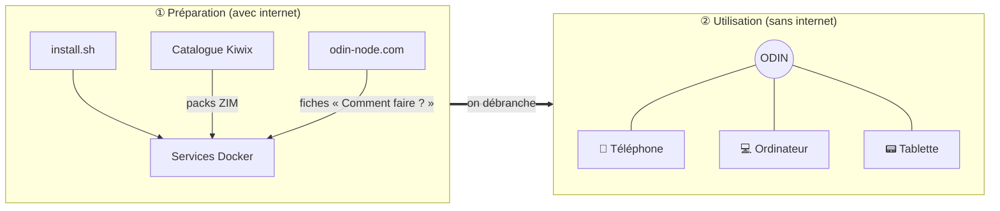
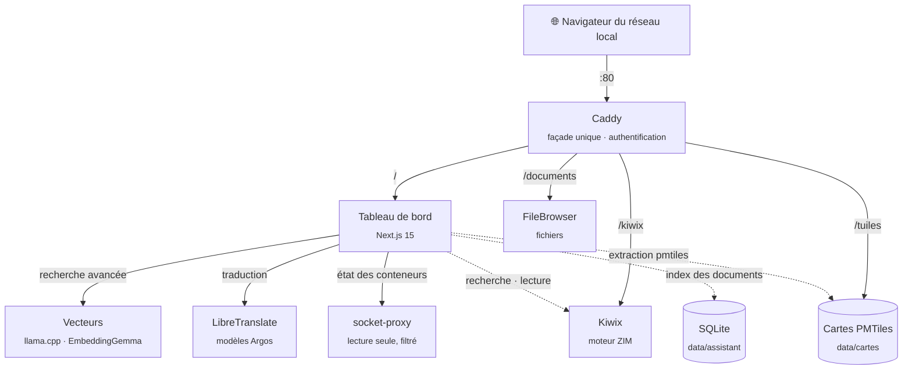

<div align="center">


### Le savoir du monde, même quand internet s'arrête.

Un serveur de connaissances **100 % hors ligne**, installable en une commande sur Ubuntu ou Debian.<br>
Wikipédia, des livres, des cartes, des fiches pratiques et vos documents, avec une recherche qui comprend vos questions,<br>
pour tous les appareils du réseau local.

[](#licence)
[](#installation)
[](#architecture)
[](#hors-ligne-par-conception)

[Pourquoi ODIN](#pourquoi-odin) · [Fonctionnalités](#ce-quodin-vous-offre) · [Architecture](#architecture) · [Installation](#installation)

</div>

---

## Pourquoi ODIN

Internet semble acquis, et pourtant il manque souvent là où on en a le plus besoin : dans un
refuge de montagne, sur un bateau, dans une école isolée, pendant une panne ou une crise, ou
simplement quand on ne veut pas que ses questions quittent la maison.

**ODIN est une réserve de savoir que l'on prépare une fois et qui sert ensuite pour de bon.**
On l'installe sur une petite machine pendant qu'on a une connexion, on y charge les contenus
voulus (encyclopédie, médecine, livres, manuels, cartes), puis on le débranche d'internet.
Chaque téléphone, tablette ou ordinateur du réseau local y accède ensuite avec un simple
navigateur, **sans application, sans compte en ligne et sans aucune connexion extérieure**.

- 🧭 **Autonome** : une fois préparé, ODIN démarre, redémarre et répond sans internet.
- 🔒 **Privé** : rien ne sort du serveur, ni télémétrie, ni requête vers un service tiers.
- 🪶 **Simple** : un seul fichier Docker Compose écrit à la main, sans orchestrateur ni magie.

## Ce qu'ODIN vous offre

| | Service | Ce qu'il fait |
|---|---|---|
| 🔎 | **Recherche avancée** | Une question en langage courant (« j'ai du mal à respirer »), et les meilleurs passages de vos documents, de l'encyclopédie, de la bibliothèque et des fiches pratiques, avec leur source et un lien vers la bonne page. Rien n'est rédigé, donc rien ne peut être inventé. |
| 📚 | **Encyclopédie** | Wikipédia, Wiktionnaire, Wikisource, Gutenberg, Vikidia… au format ZIM, avec recherche plein texte et un lecteur d'articles intégré. |
| 📖 | **Bibliothèque** | Des livres de référence en PDF, avec leur fiche d'attribution, lisibles sur ordinateur comme sur téléphone. Aucun n'est encore proposé : le premier attend l'accord de son éditeur (voir Licences). |
| ❓ | **Comment faire ?** | Les fiches pratiques du blog d'[odin-node.com](https://odin-node.com) (eau, abri, feu, premiers secours, énergie…), avec leurs schémas, installées une fois puis lisibles et cherchables hors ligne. |
| 📁 | **Documents personnels** | Un espace de fichiers partagé, accessible depuis n'importe quel navigateur du réseau. |
| 🗺️ | **Cartes** | Cartes OpenStreetMap consultables hors ligne. Un fond mondial est installé d'office ; on ajoute les régions voulues (pays, continent, monde), jusqu'au niveau des rues. Étiquettes en français. |
| 🌍 | **Traduction** | Traduction de textes sur le serveur, sans internet : français et anglais inclus, 48 autres langues à ajouter en un clic (allemand, espagnol, arabe, ukrainien…). |
| 🖥️ | **Tableau de bord** | L'état des services, la recherche, le stockage, et l'ajout de contenus en un clic tant qu'une connexion est disponible. La page **État du serveur** montre disque, mémoire, conteneurs, versions et la place prise par chaque contenu. |
| 🤖 | **Assistant IA** (option) | Sur une machine avec une carte graphique d'au moins 8 Go : il rédige une réponse à partir des passages trouvés, en citant ses sources. |

L'accès est protégé par **un mot de passe unique**, choisi lors de la première visite.

### Contenus disponibles

Ils s'installent depuis le tableau de bord (**Configuration → Encyclopédie**) :

Wikipédia (sélection illustrée, complète, ou complète avec images) · Médecine · Mathématiques ·
Physique · Chimie · Histoire · Géographie · Informatique · Changement climatique · Vikidia (8-13 ans) ·
Wiktionnaire · Wikisource · Projet Gutenberg · Wikilivres · Wikiversité · Wikivoyage

La liste se modifie dans [`catalogue/packs.txt`](catalogue/packs.txt). Les fichiers proviennent du
[catalogue Kiwix](https://library.kiwix.org) : ODIN essaie en quelques secondes les premiers miroirs
proposés et télécharge depuis le plus rapide, passe au suivant si l'un ne répond pas, et vérifie
l'empreinte SHA-256 du fichier complet. Un téléchargement interrompu reprend là où il s'était arrêté,
même sur un autre miroir.

Les cartes s'installent de la même façon (**Configuration → Cartes**), chacune avec sa taille :

Belgique · France · Suisse · Luxembourg · Québec · Maroc · Algérie · Tunisie · Antilles · La Réunion
(jusqu'aux rues) · Maghreb · Afrique de l'Ouest francophone · Europe · Canada · États-Unis ·
Monde (villes et routes, ou tout le détail)

Chaque pack est extrait à la demande du fichier mondial [Protomaps](https://protomaps.com) (données
OpenStreetMap), pour ne télécharger que la région voulue. La liste se modifie dans
[`catalogue/cartes.txt`](catalogue/cartes.txt).

### Comment faire ?

Des fiches pratiques pour tenir sans réseau, écrites pour le blog d'[odin-node.com](https://odin-node.com) :
rendre l'eau potable, garder sa chaleur, allumer un feu par temps humide, les gestes de premiers secours,
reconnaître une sirène d'alerte, calculer son autonomie électrique… Elles se lisent par catégorie, avec
leurs schémas, et répondent à la recherche (étiquette « Comment faire ? »). Chaque fiche porte aussi des
mots-clés fournis par le site : une question qui en reprend un tel quel, comme « coupure de courant » ou
« appeler le 112 », mène d'abord à la bonne fiche.

Rien n'est installé d'office : la carte **Comment faire ?** de l'accueil propose **Installer les
articles** (quelques centaines de Ko). Ensuite, **Vérifier les mises à jour** compare avec le site et
liste les articles nouveaux, modifiés ou retirés, avant **Mettre à jour**. Rien n'est vérifié en tâche de
fond. L'archive est contrôlée (empreinte SHA-256, fichiers attendus, aucun fichier en trop) et remplace
l'ancienne version d'un coup : un échec ne touche pas aux articles déjà installés. **Supprimer les
articles** se trouve dans **Configuration → Comment faire ?**.

### La recherche avancée

C'est le cœur d'ODIN. Elle ne demande ni carte graphique ni modèle de langage.

1. **Elle comprend la demande** grâce à une table de synonymes en français, écrite à la main
   ([`catalogue/synonymes.json`](catalogue/synonymes.json)) : « je me suis brûlé » cherche
   « brûlure », « mal à la tête » cherche « céphalée, migraine », « l'eau de la rivière » cherche
   « eau potable ». Santé, eau, feu, froid, nourriture, alerte et énergie sont couverts ; la table
   s'enrichit sans toucher au code.
2. **Elle cherche dans toutes les sources à la fois**, par le sens et par les mots : vos documents, les
   packs de l'encyclopédie, les livres PDF de la bibliothèque et les fiches « Comment faire ? ».
3. **Elle montre les meilleurs passages**, groupés par document, les mots cherchés surlignés, avec
   un lien vers l'article, la page du livre ou le document. Les résultats plus éloignés restent
   accessibles, repliés ; quand rien ne répond vraiment, elle le dit.
4. **Santé et sécurité** : si la question décrit un signe grave (difficulté à respirer, saignement
   important, perte de connaissance…), un bandeau en tête rappelle d'appeler les secours, adapté à ce
   qu'ODIN sait du réseau.

Vos documents sont indexés tout seuls, dès que vous en déposez dans **Documents personnels** : PDF, Word, texte,
Markdown et HTML. Rien ne sort de la machine, et tout fonctionne sans internet.

### La traduction

La page **Traduction** traduit un texte (5 000 caractères au plus) entre les langues installées, avec
détection automatique de la langue du texte. Elle tourne entièrement sur le serveur, sur le processeur,
avec [LibreTranslate](https://libretranslate.com) et les modèles [Argos Translate](https://www.argosopentech.com).

- **Français et anglais sont installés d'office** (158 Mo), et ne se désinstallent pas.
- **Les autres langues sont des packs** : **Configuration → Traduction**, ou le lien « Ajouter des
  langues » de la page. 48 langues sont proposées, de 133 Mo (norvégien) à 372 Mo (espagnol) chacune,
  avec leur taille ; l'installation vérifie l'empreinte de chaque fichier, et une langue se
  désinstalle aussi simplement. Une nouvelle langue est utilisable quelques secondes après, sans
  redémarrer quoi que ce soit.
- **Tout passe par l'anglais** : un texte allemand traduit en français passe par l'anglais, un peu
  moins précis qu'une traduction directe. La qualité varie selon les langues ; aucune mesure n'est
  publiée par les auteurs des modèles.
- **Mémoire** : environ 120 Mo au repos, et 100 à 150 Mo de plus par langue source utilisée (1 Go avec
  six langues).
- La liste des langues proposées est dans [`catalogue/traduction.json`](catalogue/traduction.json)
  (adresse, taille et empreinte de chaque modèle).

### L'état du serveur

Un bandeau discret en bas de l'accueil résume l'état du serveur : disque, mémoire, conteneurs en bonne
santé, version installée. Il passe à l'orange si le disque dépasse 85 %, au rouge au-delà de 95 % ou
si un conteneur est arrêté, redémarre en boucle ou échoue à son test de santé. Un clic ouvre la page
**État du serveur** (`/sante`) :

- **Système** : disque, mémoire, charge, durée depuis le démarrage.
- **Conteneurs** : état, santé, image et version de chaque service.
- **Versions** : commit installé (écrit par l'installeur : après une mise à jour faite à la main par
  `git pull`, il peut être ancien), image du tableau de bord, Docker.
- **Espace occupé**, du plus gros au plus petit : encyclopédie, livres, cartes, langues, fiches
  « Comment faire ? », modèles de l'assistant (option IA), vos documents, et le reste du disque. Chaque contenu retirable a son bouton
  « Désinstaller », le même que dans Configuration.

Le tableau de bord n'a pas accès au socket Docker : il lit l'état des conteneurs à travers un relais
filtré (`socket-proxy`) qui ne laisse passer que la liste des conteneurs et les informations générales
de Docker, en lecture seule.

### L'assistant IA (option)

Sur une machine qui a la carte graphique pour cela, la page **Assistant IA** installe un modèle de
langage (voir l'option IA ci-dessous). L'assistant cherche alors avec la recherche avancée, puis
rédige une réponse **uniquement** à partir des passages trouvés, avec des renvois [1] [2] vers les
sources. S'il échoue, s'il tarde à répondre ou s'il cite un chiffre absent des passages, sa réponse
est écartée et les passages s'affichent à la place. Dans **Configuration**, il reçoit un nom, un
visage (dix dessins en pixel art), une couleur, un ton, le tutoiement ou le vouvoiement.

#### Voir comment la recherche a travaillé (`?debug=1`)

Ajoutez **`?debug=1`** à l'adresse de la recherche (`/recherche?q=…&debug=1`) ou de l'assistant
(`/assistant?debug=1`) pour afficher ce que la table a compris, les requêtes envoyées, le score de
chaque passage (proximité de sens, mots-clés, règles de classement) et les passages écartés. L'option
ne vaut que pour la page ouverte et n'est enregistrée nulle part.

#### Mesurer la recherche

Un banc de 16 questions de référence vérifie le classement attendu (source, document, niveau, et les
résultats hors sujet qui ne doivent pas sortir) : [`scripts/banc-recherche.sh`](scripts/banc-recherche.sh),
sur une machine qui a les contenus de référence (WikiMed, le livre *Là où il n'y a pas de docteur*, les
fiches « Comment faire ? »). Il s'arrête en erreur si un classement régresse ; toute modification de la
recherche doit le passer.

## Comment ça marche



Internet ne sert qu'à **préparer** ODIN : l'installer, le mettre à jour, ajouter des contenus.
Il n'est jamais nécessaire pour **l'utiliser**.

## Architecture

Tout passe par **Caddy**, la seule porte d'entrée. Caddy vérifie la session auprès du tableau de bord
(`forward_auth`), puis transmet chaque requête au bon service.



| Service | Image (version figée) | Rôle |
|---|---|---|
| `caddy` | `caddy:2.11.4-alpine` | Porte d'entrée, routage, authentification déléguée au tableau de bord. |
| `dashboard` | `ghcr.io/gorgo126/odin-dashboard` | Next.js 15 (app router, sortie standalone). Accueil, recherche avancée (index SQLite de vos documents), lecteur d'articles, fiches « Comment faire ? », carte (MapLibre GL), ajout de packs et, en option, l'assistant IA. Contient l'outil `pmtiles` qui extrait les régions. |
| `kiwix` | `ghcr.io/kiwix/kiwix-serve:3.8.2` | Sert les archives ZIM de `data/zim`. Détecte les nouveaux contenus sans redémarrage. |
| `filebrowser` | `gtstef/filebrowser:1.5.6-stable` | FileBrowser Quantum, sur `data/documents`. |
| `vecteurs` | `ghcr.io/ggml-org/llama.cpp:server-v0.4.1` | Calcule le sens des passages (EmbeddingGemma, sur le processeur) pour la recherche avancée. Joignable seulement à l'intérieur d'ODIN. |
| `libretranslate` | `libretranslate/libretranslate:v1.9.6` | Traduction hors ligne (modèles Argos, sur le processeur). Sur un réseau Docker interne, sans aucune route vers internet : seul le tableau de bord le joint. Ses modèles sont installés par le tableau de bord et montés en lecture seule. |
| `socket-proxy` | `wollomatic/socket-proxy:1.13.1` (empreinte figée) | Relais du socket Docker pour la page État du serveur. Seules deux lectures passent (liste des conteneurs, informations de Docker) ; tout le reste est refusé, y compris le détail d'un conteneur (ses variables d'environnement) et ses journaux. Réseau interne, seul le tableau de bord peut s'y connecter. |
| `ollama` | `ollama/ollama:0.34.2` | **Option IA seulement** (`compose.ia.yml`), sur une machine équipée d'une carte graphique : modèle de langage de l'assistant. Absent de l'installation par défaut. |

Caddy sert aussi les fichiers de cartes sur `/tuiles`, avec les requêtes par plage : le navigateur
ne lit que les tuiles affichées.

Toutes les images sont **figées sur une version précise**. Une montée de version se fait
volontairement, après test. L'image du tableau de bord est construite par GitHub Actions pour chaque
branche, et `compose.yml` est figé automatiquement sur celle-ci.

### Arborescence

```
/opt/odin
├── compose.yml          # le fichier de déploiement (compose.ia.yml : option IA)
├── Caddyfile            # routage et authentification
├── .env                 # ports et dossier des données (modèle : .env.exemple)
├── catalogue/           # contenus (packs.txt), cartes (cartes.txt) et langues (traduction.json) proposés
├── config/              # configuration de FileBrowser
├── dashboard/           # code du tableau de bord (Next.js)
├── scripts/             # ajout de contenus en ligne de commande, banc de la recherche, outils de test
├── tests/               # tests automatiques et questions du banc de la recherche
└── data/                # vos données, jamais versionnées
    ├── zim/             #   archives ZIM + library.xml
    ├── cartes/          #   packs de cartes (.pmtiles)
    ├── documents/       #   fichiers partagés
    ├── vecteurs/        #   modèle de la recherche avancée (EmbeddingGemma, 334 Mo)
    ├── assistant/       #   index de vos documents pour la recherche avancée (SQLite)
    ├── traduction/      #   modèles de traduction (français et anglais : 158 Mo)
    └── config/          #   mot de passe (haché avec scrypt), version installée,
                         #   fiches « Comment faire ? » (guides/)
```

### Hors ligne par conception

- **Aucune ressource externe** : pas de CDN, pas de police téléchargée, pas d'analytique.
- **La carte embarque tout** : style, polices des étiquettes et icônes sont dans l'image. Aucune tuile
  ni police n'est demandée à un serveur extérieur.
- **La traduction ne peut rien télécharger** : LibreTranslate est sur un réseau Docker sans accès à
  internet, et lit ses modèles en lecture seule. C'est le tableau de bord qui les installe, y compris
  le découpage en phrases qu'il irait sinon chercher à la première traduction de chaque langue.
- **Aucun service ne vérifie ses mises à jour** : le service de vecteurs lit son modèle sur le disque,
  FileBrowser tourne sans vérification de version, et Ollama (option IA) avec `OLLAMA_NO_CLOUD=true`.
- **Chaque appel réseau d'ODIN a un délai.** Hors ligne, le catalogue répond « injoignable » en
  2 secondes, et un téléchargement interrompu s'arrête après 30 secondes sans données. On peut
  aussi l'annuler, ou le reprendre plus tard là où il s'était arrêté. Les tailles des packs restent
  affichées hors ligne.
- **Rien n'est vérifié en tâche de fond** : les fiches « Comment faire ? » ne consultent le site que sur
  demande (« Vérifier les mises à jour »), et les boutons qui demandent internet sont grisés sans lui.
- **Testé réellement déconnecté** : [`scripts/hors-ligne.sh`](scripts/hors-ligne.sh) coupe internet
  sur une machine de test en gardant le réseau local, et consigne chaque tentative de sortie.

## Installation

### Prérequis

| | Minimum conseillé |
|---|---|
| Système | Ubuntu 24.04 LTS ou Debian 12, architecture x86_64 |
| Processeur | 4 cœurs |
| Mémoire | 8 Go (la recherche avancée en utilise environ 0,5 Go, la traduction de 0,1 à 1 Go selon les langues utilisées) |
| Disque | 40 Go, plus la taille des contenus (de 80 Mo à plusieurs dizaines de Go par pack) |
| Réseau | Une connexion internet **pendant l'installation seulement** |

### En une commande

```bash
curl -fsSL https://raw.githubusercontent.com/Gorgo126/ODIN/main/install.sh | sudo bash
```

Le script installe Docker si besoin, récupère ODIN dans `/opt/odin`, démarre les services et
télécharge le modèle de la recherche avancée (EmbeddingGemma, 334 Mo, empreinte vérifiée), les modèles
de traduction français et anglais (158 Mo, empreintes vérifiées) et le fond de carte mondial (45 Mo). Aucun modèle de langage n'est installé par défaut. À la fin, il affiche
les adresses où joindre ODIN.

### Première visite

1. Depuis n'importe quel appareil du réseau, ouvrez **http://odin.local**, ou l'adresse IP affichée à la fin de l'installation.
2. Choisissez le mot de passe qui protégera ODIN.
3. Dans **Configuration**, installez les contenus, les cartes, les langues de traduction et les fiches « Comment faire ? » voulus tant que la connexion est disponible.
4. Posez une question dans la barre de recherche, en langage courant : « comment rendre l'eau potable ? ».

C'est prêt : vous pouvez débrancher internet.

### Option IA (non vérifiée)

ODIN n'a pas besoin d'IA : la recherche avancée trouve les passages et leurs sources. L'assistant IA, qui
rédige une réponse à partir de ces passages, est une **option** pour les machines équipées d'une carte
graphique NVIDIA ou AMD d'au moins 8 Go. L'installeur détecte la carte ; la page **Assistant IA** propose
alors le modèle adapté (8 milliards de paramètres pour 8 Go, 14 milliards pour 16 Go), vérifie l'espace
disque, le télécharge et teste son chargement sur la carte.

> **Non vérifié sur du vrai matériel.** Ce chemin a été écrit sans carte graphique pour le tester : seul
> son parcours a été testé, en simulation (carte fictive, modèle sur le processeur). Ni le passage de la
> carte au conteneur, ni la détection du matériel et l'installation des pilotes sur une vraie machine
> Ubuntu, ni une carte de 8 Go exactement n'ont été éprouvés. Sans carte adaptée, rien n'est téléchargé
> et ODIN fonctionne en recherche avancée.

### Point d'accès Wi-Fi (option, non vérifiée)

Sans box ni routeur, ODIN peut créer **son propre réseau Wi-Fi** avec la carte Wi-Fi de la machine :
un téléphone rejoint le réseau « ODIN », une page d'accueil s'ouvre d'elle-même (portail captif), puis
on utilise ODIN dans son navigateur habituel, à l'adresse `http://10.42.0.1` ou `http://<nom>.lan`.
Option désactivée par défaut, activée à l'installation :

```bash
curl -fsSL https://raw.githubusercontent.com/Gorgo126/ODIN/main/install.sh | sudo POINT_ACCES=1 bash
```

- Réseau en **2,4 GHz** (canal 1, 6 ou 11, le moins encombré à chaque démarrage), **WPA2** avec un mot
  de passe généré, affiché à la fin de l'installation et gardé aux mises à jour. Deux QR codes (rejoindre
  le réseau, ouvrir ODIN) sont produits dans `data/config/`.
- **Aucun accès à internet** pour les appareils du réseau, même quand ODIN en a un : seul ODIN est
  joignable, et les appareils ne se voient pas entre eux.
- **Seule la carte Wi-Fi est touchée** : l'Ethernet, sa configuration et Docker restent tels quels. Une
  carte Wi-Fi qui sert déjà à la connexion de la machine n'est pas prise : préparez ODIN par l'Ethernet.
- **Jamais bloquant** : sans carte compatible, ou si le point d'accès ne démarre pas, l'installation se
  termine normalement en indiquant la raison, et ODIN reste joignable par le réseau existant. Le
  démarrage de la machine n'attend jamais le Wi-Fi.
- **Portail captif** : à la connexion, le téléphone ou l'ordinateur ouvre la page de bienvenue d'ODIN ;
  après « Continuer », elle indique l'adresse à retenir. Android, iPhone, Windows, Firefox et Linux
  (NetworkManager) sont reconnus.
- **Fiche à imprimer** (Configuration → Point d'accès Wi-Fi) : nom du réseau, mot de passe, adresse et
  deux QR codes, à poser à côté de la machine.
- Relancer l'installeur avec `POINT_ACCES=0` retire tout et rend la carte au système (NetworkManager
  compris).

**Limites connues**
- **Android reste en « connectivité limitée »** après « Continuer » : il exige une réponse d'un site HTTPS
  de Google, impossible sans internet. Il peut alors garder la 4G pour naviguer, et ODIN devient
  introuvable : accepter « Utiliser ce réseau » / « Rester connecté » dans la notification, ou couper les
  données mobiles (la page du portail le rappelle).
- Les adresses en **HTTPS** d'autres sites échouent (erreur de certificat) : c'est inévitable hors ligne.
- Un appareil réglé sur un **DNS privé** (DNS over TLS/HTTPS forcé) ne voit ni le portail ni les noms
  d'ODIN : taper `http://10.42.0.1`, ou scanner le QR code de la fiche.
- Certains navigateurs mobiles prennent `odin.lan` pour une recherche : taper `http://` devant, ou utiliser
  le QR code d'adresse.

> **Non vérifié sur du vrai matériel.** Ce chemin a été testé avec des radios Wi-Fi virtuelles
> (`mac80211_hwsim`) : connexion, bail, DNS, accès à ODIN, absence de sortie vers internet, redémarrage,
> retrait, avec et sans NetworkManager. Restent non vérifiés : les vrais pilotes (Intel, MediaTek,
> Realtek), la portée, le nombre d'appareils, et le comportement de vrais téléphones et ordinateurs.
> Le portail captif a été testé avec les sondes de chaque système simulées une à une, pas avec de
> vraies fenêtres de portail d'iOS, d'Android ou de Windows.

### Options d'installation

Des variables, placées **après `sudo`**, ajustent l'installation :

```bash
curl -fsSL https://raw.githubusercontent.com/Gorgo126/ODIN/main/install.sh \
  | sudo NOM_HOTE=bibliotheque bash
```

| Variable | Défaut | Effet |
|---|---|---|
| `NOM_HOTE` | `odin` | Nom de la machine sur le réseau (`http://<nom>.local`). Une mise à jour garde le nom actuel. |
| `BRANCHE` | `main` | Branche d'ODIN à installer. |
| `DEPOT` | ce dépôt | Dépôt Git à cloner, pour une copie personnelle d'ODIN. |
| `DONNEES` | `/opt/odin/data` | Dossier des données (chemin absolu), par exemple sur un gros disque de données. |
| `POINT_ACCES` | `0` | `1` : ODIN crée son propre réseau Wi-Fi (option non vérifiée, voir plus haut). Gardé aux mises à jour ; `0` le retire. |

Dans `/opt/odin/.env`, `TRADUCTION_LANGUES` (défaut `fr,en`) choisit les langues de traduction d'une
**première** installation, par exemple `fr,en,de,es` ; ensuite, les langues se gèrent dans ODIN, et une
mise à jour ne réinstalle que le français et l'anglais s'ils manquaient.

Les ports se règlent dans `/opt/odin/.env`, comme le dossier des données (`DATA_DIR`, écrit par `DONNEES`).
Le point d'accès s'y règle aussi : `POINT_ACCES_SSID` (nom du réseau, `ODIN`), `POINT_ACCES_RESEAU`
(`10.42.0.1/24`), `POINT_ACCES_INTERFACE` (carte imposée) et `PAYS` (code pays, déduit sinon du fuseau
horaire) ; relancer l'installeur ensuite.

### Disques

ODIN s'installe dans `/opt/odin`, et Docker garde ses images sur le disque système (`/var/lib/docker`) :
environ 3 Go sans l'option IA, 12 Go de plus avec elle. Tout le reste, et c'est le plus gros (packs,
livres, cartes, documents, index), va dans le **dossier des données**. L'installeur vérifie la place
libre avant de télécharger quoi que ce soit, et chaque ajout de contenu vérifie la sienne, en comptant
les téléchargements déjà en cours. Après une mise à jour, il ne garde que l'image actuelle de chaque
service et la précédente, pour pouvoir revenir en arrière.

**Petit disque système et gros disque de données** : montez le disque de données (par exemple sur
`/mnt/donnees`, déclaré dans `/etc/fstab`), puis installez avec `DONNEES` :

```bash
curl -fsSL https://raw.githubusercontent.com/Gorgo126/ODIN/main/install.sh \
  | sudo DONNEES=/mnt/donnees/odin bash
```

Docker attend alors ce montage à chaque démarrage. Des données déjà présentes ne sont jamais déplacées
d'office : l'installeur explique comment le faire.

**Déplacer aussi les images Docker** (facultatif, à faire soi-même : ODIN ne touche pas à la
configuration de Docker) :

```bash
sudo systemctl stop docker docker.socket
sudo rsync -aP /var/lib/docker/ /mnt/donnees/docker/
# Ajouter "data-root" à /etc/docker/daemon.json (fusionner avec son contenu s'il existe déjà) :
echo '{ "data-root": "/mnt/donnees/docker" }' | sudo tee /etc/docker/daemon.json
sudo systemctl start docker
docker info --format '{{.DockerRootDir}}'   # doit afficher /mnt/donnees/docker
# Une fois ODIN vérifié : sudo rm -rf /var/lib/docker
```

### Ajouter du contenu en ligne de commande

```bash
/opt/odin/scripts/ajouter.sh --liste       # packs disponibles et leur taille
/opt/odin/scripts/ajouter.sh medecine      # télécharge et installe un pack
```

Le script passe par ODIN lui-même (il faut que le tableau de bord tourne) : même choix du miroir le plus
rapide, même vérification de l'empreinte SHA-256 et même inscription dans la bibliothèque que la page
**Configuration**. Ctrl+C arrête l'affichage, pas le téléchargement.

Vous pouvez aussi déposer vos propres fichiers `.zim` dans `/opt/odin/data/zim`, puis lancer
`/opt/odin/scripts/maj-bibliotheque.sh`.

### Mettre à jour

Relancez simplement la commande d'installation. Elle met à jour les sources et les services, et ne
touche pas à vos données dans `data/`. Les fiches « Comment faire ? » se mettent à jour à part, depuis
**Configuration → Comment faire ?** (« Vérifier les mises à jour », puis « Mettre à jour »).

## Licences

**Le code d'ODIN est sous licence [MIT](https://opensource.org/license/mit).** Les contenus qu'ODIN
installe gardent chacun leur propre licence, qui ne s'étend pas à ODIN : installer un contenu non
commercial ne rend pas ODIN non commercial, et la licence MIT ne s'applique pas à ces contenus. Chaque
licence est rappelée dans ODIN, là où le contenu s'affiche.

| Contenu | Origine | Licence | Où ODIN l'indique |
|---|---|---|---|
| Wikipédia, Wiktionnaire, Wikisource, Wikilivres, Wikiversité, Wikivoyage | Catalogue Kiwix | Textes [CC BY-SA 4.0](https://creativecommons.org/licenses/by-sa/4.0/deed.fr) (contributeurs de chaque projet) ; les images ont chacune leur licence | Sous chaque article du lecteur ; liste des packs (Configuration) |
| Vikidia | Catalogue Kiwix | [CC BY-SA 3.0 et GFDL](https://fr.vikidia.org/wiki/Vikidia:Droit_d'auteur) | Idem |
| Projet Gutenberg | Catalogue Kiwix | Domaine public, avec la [licence et la marque Project Gutenberg](https://www.gutenberg.org/policy/license.html) | Idem |
| Cartes | [Protomaps](https://protomaps.com), données OpenStreetMap | Données © contributeurs d'OpenStreetMap, [ODbL 1.0](https://opendatacommons.org/licenses/odbl/) | Sur la carte ; section Cartes de Configuration |
| *Là où il n'y a pas de docteur* (Hesperian, 2019) | PDF de l'édition Hesperian, téléchargé pour l'instant depuis dokotoro.org (à remplacer par la source d'Hesperian) | [Licence ouverte Hesperian](https://hesperian.org/open-copyright-policy/) : usage **non commercial**, attribution, fichier non modifié. La distribution numérique demande l'accord écrit d'Hesperian, demandé en septembre 2026 : d'ici là, le livre n'est pas proposé par la version publiée d'ODIN. | Fiche du livre (origine du fichier, licence, restriction) |
| EmbeddingGemma (Google), modèle de la recherche | Hugging Face (ggml-org) | [Conditions d'utilisation de Gemma](https://ai.google.dev/gemma/terms) : pas une licence libre ; [politique d'utilisation](https://ai.google.dev/gemma/prohibited_use_policy) à respecter | Ici |
| Qwen3 (option IA) | Registre Ollama | Apache 2.0 | Page Assistant IA |
| socket-proxy (relais Docker filtré) | Image Docker officielle, non modifiée | [MIT](https://github.com/wollomatic/socket-proxy/blob/main/LICENSE) | Ici |
| LibreTranslate (logiciel de traduction) | Image Docker officielle, non modifiée | [AGPL-3.0](https://github.com/LibreTranslate/LibreTranslate/blob/main/LICENSE) | Ici |
| Modèles de traduction Argos | Index [argospm-index](https://github.com/argosopentech/argospm-index), découpage en phrases [MiniSBD](https://github.com/LibreTranslate/MiniSBD) | Propre à chaque modèle, indiquée dans le fichier README de son paquet (par exemple CC BY 4.0 pour le modèle français → anglais, dérivé d'OPUS-MT) | Ici |
