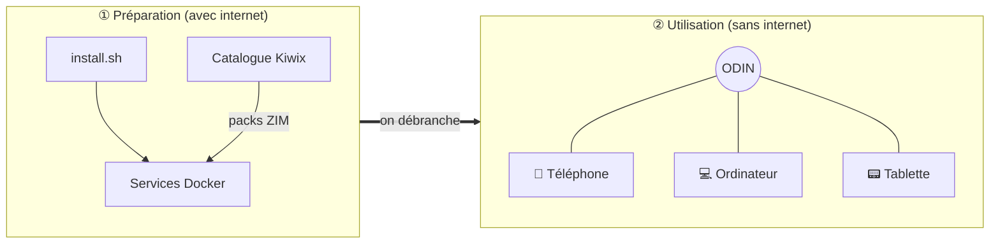
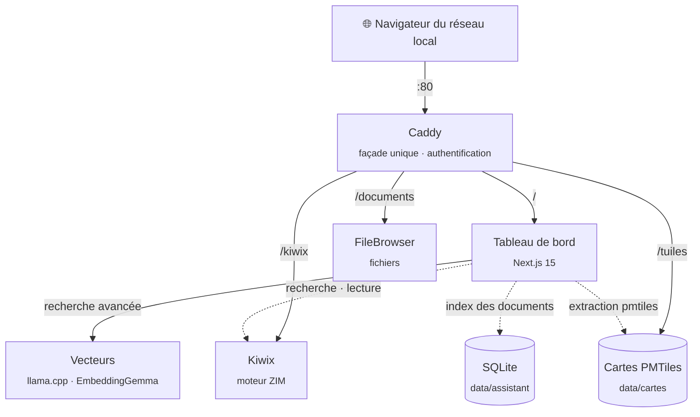

<div align="center">


### Le savoir du monde, même quand internet s'arrête.

Un serveur de connaissances **100 % hors ligne**, installable en une commande sur Ubuntu ou Debian.<br>
Wikipédia, des livres, des cartes et vos documents, avec une recherche qui comprend vos questions,<br>
pour tous les appareils du réseau local.

[](#licence)
[](#installation)
[](#architecture)
[](#hors-ligne-par-conception)

[Pourquoi ODIN](#pourquoi-odin) · [Fonctionnalités](#ce-quodin-vous-offre) · [Architecture](#architecture) · [Installation](#installation)

</div>

---

## Pourquoi ODIN

Internet semble acquis, et pourtant il manque souvent là où on en a le plus besoin : dans un
refuge de montagne, sur un bateau, dans une école isolée, pendant une panne ou une crise, ou
simplement quand on ne veut pas que ses questions quittent la maison.

**ODIN est une réserve de savoir que l'on prépare une fois et qui sert ensuite pour de bon.**
On l'installe sur une petite machine pendant qu'on a une connexion, on y charge les contenus
voulus (encyclopédie, médecine, livres, manuels, cartes), puis on le débranche d'internet.
Chaque téléphone, tablette ou ordinateur du réseau local y accède ensuite avec un simple
navigateur, **sans application, sans compte en ligne et sans aucune connexion extérieure**.

- 🧭 **Autonome** : une fois préparé, ODIN démarre, redémarre et répond sans internet.
- 🔒 **Privé** : rien ne sort du serveur, ni télémétrie, ni requête vers un service tiers.
- 🪶 **Simple** : un seul fichier Docker Compose écrit à la main, sans orchestrateur ni magie.

## Ce qu'ODIN vous offre

| | Service | Ce qu'il fait |
|---|---|---|
| 📚 | **Bibliothèque** | Wikipédia, Wiktionnaire, Wikisource, Gutenberg, Vikidia… au format ZIM, avec recherche plein texte et un lecteur d'articles intégré. |
| 📁 | **Documents** | Un espace de fichiers partagé, accessible depuis n'importe quel navigateur du réseau. |
| 🗺️ | **Carte** | Cartes OpenStreetMap consultables hors ligne. Un fond mondial est installé d'office ; on ajoute les régions voulues (pays, continent, monde), jusqu'au niveau des rues. Étiquettes en français. |
| 🔎 | **Recherche avancée** | Une question en langage courant (« j'ai du mal à respirer »), et les meilleurs passages de vos documents, de la bibliothèque et de vos livres, avec leur source et un lien vers la bonne page. Rien n'est rédigé, donc rien ne peut être inventé. |
| 📖 | **Livres** | Des livres de référence en PDF, avec leur fiche d'attribution, lisibles sur ordinateur comme sur téléphone. |
| 🤖 | **Assistant IA** (option) | Sur une machine avec une carte graphique d'au moins 8 Go : il rédige une réponse à partir des passages trouvés, en citant ses sources. |
| 🖥️ | **Tableau de bord** | L'état des services, une recherche dans toute la bibliothèque, le stockage, et l'ajout de contenus en un clic tant qu'une connexion est disponible. |

L'accès est protégé par **un mot de passe unique**, choisi lors de la première visite.

### Contenus disponibles

Ils s'installent depuis le tableau de bord (**Configuration → Bibliothèque**) :

Wikipédia (sélection illustrée, complète, ou complète avec images) · Médecine · Mathématiques ·
Physique · Chimie · Histoire · Géographie · Informatique · Changement climatique · Vikidia (8-13 ans) ·
Wiktionnaire · Wikisource · Projet Gutenberg · Wikilivres · Wikiversité · Wikivoyage

La liste se modifie dans [`catalogue/packs.txt`](catalogue/packs.txt). Les fichiers proviennent du
[catalogue Kiwix](https://library.kiwix.org).

Les cartes s'installent de la même façon (**Configuration → Cartes**), chacune avec sa taille :

Belgique · France · Suisse · Luxembourg · Québec · Maroc · Algérie · Tunisie · Antilles · La Réunion
(jusqu'aux rues) · Maghreb · Afrique de l'Ouest francophone · Europe · Canada · États-Unis ·
Monde (villes et routes, ou tout le détail)

Chaque pack est extrait à la demande du fichier mondial [Protomaps](https://protomaps.com) (données
OpenStreetMap), pour ne télécharger que la région voulue. La liste se modifie dans
[`catalogue/cartes.txt`](catalogue/cartes.txt).

### La recherche avancée

C'est le cœur d'ODIN. Elle ne demande ni carte graphique ni modèle de langage.

1. **Elle comprend la demande** grâce à une table de synonymes en français, écrite à la main
   ([`catalogue/synonymes.json`](catalogue/synonymes.json)) : « je me suis brûlé » cherche
   « brûlure », « mal à la tête » cherche « céphalée, migraine », « l'eau de la rivière » cherche
   « eau potable ». Santé, eau, feu, froid et nourriture sont couverts ; la table s'enrichit sans
   toucher au code.
2. **Elle cherche dans trois sources à la fois**, par le sens et par les mots : vos documents, les
   packs de la bibliothèque et vos livres PDF.
3. **Elle montre les meilleurs passages**, groupés par document, les mots cherchés surlignés, avec
   un lien vers l'article, la page du livre ou le document. Les résultats plus éloignés restent
   accessibles, repliés ; quand rien ne répond vraiment, elle le dit.
4. **Santé et sécurité** : si la question décrit un signe grave (difficulté à respirer, saignement
   important, perte de connaissance…), un bandeau en tête rappelle d'appeler les secours, adapté à ce
   qu'ODIN sait du réseau.

Vos documents sont indexés tout seuls, dès que vous en déposez dans **Documents** : PDF, Word, texte,
Markdown et HTML. Rien ne sort de la machine, et tout fonctionne sans internet.

### L'assistant IA (option)

Sur une machine qui a la carte graphique pour cela, la page **Assistant IA** installe un modèle de
langage (voir l'option IA ci-dessous). L'assistant cherche alors avec la recherche avancée, puis
rédige une réponse **uniquement** à partir des passages trouvés, avec des renvois [1] [2] vers les
sources. S'il échoue, s'il tarde à répondre ou s'il cite un chiffre absent des passages, sa réponse
est écartée et les passages s'affichent à la place. Dans **Configuration**, il reçoit un nom, un
visage (dix dessins en pixel art), une couleur, un ton, le tutoiement ou le vouvoiement.

#### Voir comment la recherche a travaillé (`?debug=1`)

Ajoutez **`?debug=1`** à l'adresse de la recherche (`/recherche?q=…&debug=1`) ou de l'assistant
(`/assistant?debug=1`) pour afficher ce que la table a compris, les requêtes envoyées, le score de
chaque passage (proximité de sens, mots-clés, règles de classement) et les passages écartés. L'option
ne vaut que pour la page ouverte et n'est enregistrée nulle part.

## Comment ça marche



Internet ne sert qu'à **préparer** ODIN : l'installer, le mettre à jour, ajouter des contenus.
Il n'est jamais nécessaire pour **l'utiliser**.

## Architecture

Tout passe par **Caddy**, la seule porte d'entrée. Caddy vérifie la session auprès du tableau de bord
(`forward_auth`), puis transmet chaque requête au bon service.



| Service | Image (version figée) | Rôle |
|---|---|---|
| `caddy` | `caddy:2.11.4-alpine` | Porte d'entrée, routage, authentification déléguée au tableau de bord. |
| `dashboard` | `ghcr.io/gorgo126/odin-dashboard` | Next.js 15 (app router, sortie standalone). Accueil, recherche, lecteur d'articles, carte (MapLibre GL), ajout de packs, et l'assistant : son index (SQLite) et ses réponses. Contient l'outil `pmtiles` qui extrait les régions. |
| `kiwix` | `ghcr.io/kiwix/kiwix-serve:3.8.2` | Sert les archives ZIM de `data/zim`. Détecte les nouveaux contenus sans redémarrage. |
| `filebrowser` | `gtstef/filebrowser:1.5.6-stable` | FileBrowser Quantum, sur `data/documents`. |
| `vecteurs` | `ghcr.io/ggml-org/llama.cpp:server-v0.4.1` | Calcule le sens des passages (EmbeddingGemma, sur le processeur) pour la recherche avancée. Joignable seulement à l'intérieur d'ODIN. |
| `ollama` | `ollama/ollama:0.34.2` | **Option IA seulement** (`compose.ia.yml`), sur une machine équipée d'une carte graphique : modèle de langage de l'assistant. Absent de l'installation par défaut. |

Caddy sert aussi les fichiers de cartes sur `/tuiles`, avec les requêtes par plage : le navigateur
ne lit que les tuiles affichées.

Toutes les images sont **figées sur une version précise**. Une montée de version se fait
volontairement, après test. L'image du tableau de bord est construite par GitHub Actions pour chaque
branche, et `compose.yml` est figé automatiquement sur celle-ci.

### Arborescence

```
/opt/odin
├── compose.yml          # le fichier de déploiement (compose.ia.yml : option IA)
├── Caddyfile            # routage et authentification
├── .env                 # ports et dossier des données (modèle : .env.exemple)
├── catalogue/           # contenus (packs.txt) et cartes (cartes.txt) proposés
├── config/              # configuration de FileBrowser
├── dashboard/           # code du tableau de bord (Next.js)
├── scripts/             # ajout de contenus en ligne de commande, outils de test
└── data/                # vos données, jamais versionnées
    ├── zim/             #   archives ZIM + library.xml
    ├── cartes/          #   packs de cartes (.pmtiles)
    ├── documents/       #   fichiers partagés
    ├── vecteurs/        #   modèle de la recherche avancée (EmbeddingGemma, 334 Mo)
    ├── assistant/       #   index des documents de l'assistant (SQLite)
    └── config/          #   mot de passe (haché avec scrypt)
```

### Hors ligne par conception

- **Aucune ressource externe** : pas de CDN, pas de police téléchargée, pas d'analytique.
- **La carte embarque tout** : style, polices des étiquettes et icônes sont dans l'image. Aucune tuile
  ni police n'est demandée à un serveur extérieur.
- **Aucun service ne vérifie ses mises à jour** : le service de vecteurs lit son modèle sur le disque,
  FileBrowser tourne sans vérification de version, et Ollama (option IA) avec `OLLAMA_NO_CLOUD=true`.
- **Chaque appel réseau d'ODIN a un délai.** Hors ligne, le catalogue répond « injoignable » en
  2 secondes, et un téléchargement interrompu s'arrête après 30 secondes sans données. On peut
  aussi l'annuler, ou le reprendre plus tard là où il s'était arrêté. Les tailles des packs restent
  affichées hors ligne.
- **Testé réellement déconnecté** : [`scripts/hors-ligne.sh`](scripts/hors-ligne.sh) coupe internet
  sur une machine de test en gardant le réseau local, et consigne chaque tentative de sortie.

## Installation

### Prérequis

| | Minimum conseillé |
|---|---|
| Système | Ubuntu 24.04 LTS ou Debian 12, architecture x86_64 |
| Processeur | 4 cœurs |
| Mémoire | 8 Go (la recherche avancée en utilise environ 0,5 Go) |
| Disque | 40 Go, plus la taille des contenus (de 80 Mo à plusieurs dizaines de Go par pack) |
| Réseau | Une connexion internet **pendant l'installation seulement** |

### En une commande

```bash
curl -fsSL https://raw.githubusercontent.com/Gorgo126/ODIN/main/install.sh | sudo bash
```

Le script installe Docker si besoin, récupère ODIN dans `/opt/odin`, démarre les services et
télécharge le modèle de la recherche avancée (EmbeddingGemma, 334 Mo, empreinte vérifiée) et le fond de carte mondial (45 Mo). Aucun modèle de langage n'est installé par défaut. À la fin, il affiche
les adresses où joindre ODIN.

### Première visite

1. Depuis n'importe quel appareil du réseau, ouvrez **http://odin.local**, ou l'adresse IP affichée à la fin de l'installation.
2. Choisissez le mot de passe qui protégera ODIN.
3. Dans **Configuration**, installez les contenus et les cartes voulus tant que la connexion est disponible.
4. Ouvrez **l'assistant** : donnez-lui un nom, un visage et une couleur, puis posez-lui une question.

C'est prêt : vous pouvez débrancher internet.

### Option IA (non vérifiée)

ODIN n'a pas besoin d'IA : la recherche avancée trouve les passages et leurs sources. L'assistant IA, qui
rédige une réponse à partir de ces passages, est une **option** pour les machines équipées d'une carte
graphique NVIDIA ou AMD d'au moins 8 Go. L'installeur détecte la carte ; la page **Assistant IA** propose
alors le modèle adapté (8 milliards de paramètres pour 8 Go, 14 milliards pour 16 Go), vérifie l'espace
disque, le télécharge et teste son chargement sur la carte.

> **Non vérifié sur du vrai matériel.** Ce chemin a été écrit sans carte graphique pour le tester : seul
> son parcours a été testé, en simulation (carte fictive, modèle sur le processeur). Ni le passage de la
> carte au conteneur, ni la détection du matériel et l'installation des pilotes sur une vraie machine
> Ubuntu, ni une carte de 8 Go exactement n'ont été éprouvés. Sans carte adaptée, rien n'est téléchargé
> et ODIN fonctionne en recherche avancée.

### Options d'installation

Des variables, placées **après `sudo`**, ajustent l'installation :

```bash
curl -fsSL https://raw.githubusercontent.com/Gorgo126/ODIN/main/install.sh \
  | sudo NOM_HOTE=bibliotheque bash
```

| Variable | Défaut | Effet |
|---|---|---|
| `NOM_HOTE` | `odin` | Nom de la machine sur le réseau (`http://<nom>.local`). Une mise à jour garde le nom actuel. |
| `BRANCHE` | `main` | Branche d'ODIN à installer. |
| `DEPOT` | ce dépôt | Dépôt Git à cloner, pour une copie personnelle d'ODIN. |
| `DONNEES` | `/opt/odin/data` | Dossier des données (chemin absolu), par exemple sur un gros disque de données. |

Les ports se règlent dans `/opt/odin/.env`, comme le dossier des données (`DATA_DIR`, écrit par `DONNEES`).

### Disques

ODIN s'installe dans `/opt/odin`, et Docker garde ses images sur le disque système (`/var/lib/docker`) :
environ 2,5 Go sans l'option IA, 12 Go de plus avec elle. Tout le reste, et c'est le plus gros (packs,
livres, cartes, documents, index), va dans le **dossier des données**. L'installeur vérifie la place
libre avant de télécharger quoi que ce soit, et chaque ajout de contenu vérifie la sienne, en comptant
les téléchargements déjà en cours. Après une mise à jour, il ne garde que l'image actuelle de chaque
service et la précédente, pour pouvoir revenir en arrière.

**Petit disque système et gros disque de données** : montez le disque de données (par exemple sur
`/mnt/donnees`, déclaré dans `/etc/fstab`), puis installez avec `DONNEES` :

```bash
curl -fsSL https://raw.githubusercontent.com/Gorgo126/ODIN/main/install.sh \
  | sudo DONNEES=/mnt/donnees/odin bash
```

Docker attend alors ce montage à chaque démarrage. Des données déjà présentes ne sont jamais déplacées
d'office : l'installeur explique comment le faire.

**Déplacer aussi les images Docker** (facultatif, à faire soi-même : ODIN ne touche pas à la
configuration de Docker) :

```bash
sudo systemctl stop docker docker.socket
sudo rsync -aP /var/lib/docker/ /mnt/donnees/docker/
# Ajouter "data-root" à /etc/docker/daemon.json (fusionner avec son contenu s'il existe déjà) :
echo '{ "data-root": "/mnt/donnees/docker" }' | sudo tee /etc/docker/daemon.json
sudo systemctl start docker
docker info --format '{{.DockerRootDir}}'   # doit afficher /mnt/donnees/docker
# Une fois ODIN vérifié : sudo rm -rf /var/lib/docker
```

### Ajouter du contenu en ligne de commande

```bash
/opt/odin/scripts/ajouter.sh --liste       # packs disponibles et leur taille
/opt/odin/scripts/ajouter.sh medecine      # télécharge et installe un pack
```

Vous pouvez aussi déposer vos propres fichiers `.zim` dans `/opt/odin/data/zim`, puis lancer
`/opt/odin/scripts/maj-bibliotheque.sh`.

### Mettre à jour

Relancez simplement la commande d'installation. Elle met à jour les sources et les services, et ne
touche pas à vos données dans `data/`.

## Licences

**Le code d'ODIN est sous licence [MIT](https://opensource.org/license/mit).** Les contenus qu'ODIN
installe gardent chacun leur propre licence, qui ne s'étend pas à ODIN : installer un contenu non
commercial ne rend pas ODIN non commercial, et la licence MIT ne s'applique pas à ces contenus. Chaque
licence est rappelée dans ODIN, là où le contenu s'affiche.

| Contenu | Origine | Licence | Où ODIN l'indique |
|---|---|---|---|
| Wikipédia, Wiktionnaire, Wikisource, Wikilivres, Wikiversité, Wikivoyage | Catalogue Kiwix | Textes [CC BY-SA 4.0](https://creativecommons.org/licenses/by-sa/4.0/deed.fr) (contributeurs de chaque projet) ; les images ont chacune leur licence | Sous chaque article du lecteur ; liste des packs (Configuration) |
| Vikidia | Catalogue Kiwix | [CC BY-SA 3.0 et GFDL](https://fr.vikidia.org/wiki/Vikidia:Droit_d'auteur) | Idem |
| Projet Gutenberg | Catalogue Kiwix | Domaine public, avec la [licence et la marque Project Gutenberg](https://www.gutenberg.org/policy/license.html) | Idem |
| Cartes | [Protomaps](https://protomaps.com), données OpenStreetMap | Données © contributeurs d'OpenStreetMap, [ODbL 1.0](https://opendatacommons.org/licenses/odbl/) | Sur la carte ; section Cartes de Configuration |
| *Là où il n'y a pas de docteur* (Hesperian, 2019) | PDF de l'édition Hesperian, téléchargé pour l'instant depuis dokotoro.org (à remplacer par la source d'Hesperian) | [Licence ouverte Hesperian](https://hesperian.org/open-copyright-policy/) : usage **non commercial**, attribution, fichier non modifié. La distribution numérique demande l'accord écrit d'Hesperian, demandé en septembre 2026 : d'ici là, le livre n'est pas proposé par la version publiée d'ODIN. | Fiche du livre (origine du fichier, licence, restriction) |
| EmbeddingGemma (Google), modèle de la recherche | Hugging Face (ggml-org) | [Conditions d'utilisation de Gemma](https://ai.google.dev/gemma/terms) : pas une licence libre ; [politique d'utilisation](https://ai.google.dev/gemma/prohibited_use_policy) à respecter | Ici |
| Qwen3 (option IA) | Registre Ollama | Apache 2.0 | Page Assistant IA |
